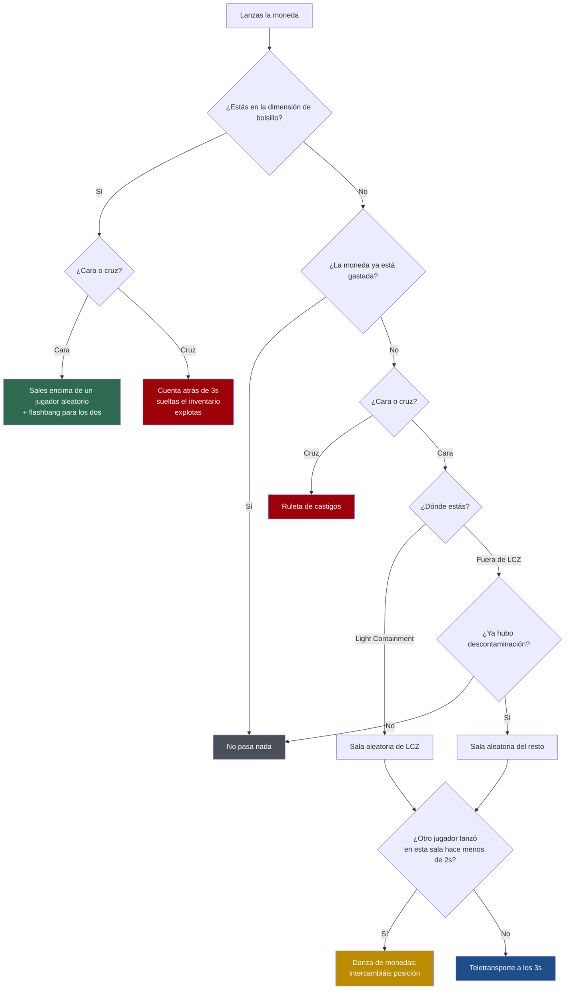

<div align="center">

# 🪙 ItemRandomizerPlugin

**La moneda deja de ser un item inútil y se convierte en la mecánica más peligrosa del servidor.**

Un plugin de EXILED para SCP: Secret Laboratory donde cada jugador spawnea con una apuesta en el bolsillo.


</div>

---

## Índice

- [La idea](#la-idea)
- [Cómo funciona la moneda](#cómo-funciona-la-moneda)
- [Mecánicas](#mecánicas)
  - [🌀 La dimensión de bolsillo](#-la-dimensión-de-bolsillo)
  - [💀 La ruleta de cruz](#-la-ruleta-de-cruz)
  - [💃 La danza de monedas](#-la-danza-de-monedas)
  - [🎰 La máquina de SCP-173](#-la-máquina-de-scp-173)
  - [📢 Comedia de servidor](#-comedia-de-servidor)
- [Instalación](#instalación)
- [Calibrar el punto de la máquina](#calibrar-el-punto-de-la-máquina)
- [Configuración](#configuración)
- [Traducciones](#traducciones)
- [Permisos](#permisos)
- [Compilar](#compilar)
- [Estructura del proyecto](#estructura-del-proyecto)

---

## La idea

Todo el que spawnea recibe **una moneda gratis**. Sirve exactamente una vez, y lo que hace depende
de dónde estés y de cómo caiga.

No es un teletransporte: es una apuesta. Cara te mueve, cruz te castiga, y dentro de la dimensión
de bolsillo la cara te salva la vida y la cruz te la quita.

> [!TIP]
> La gracia del plugin está en que **el servidor entero se entera**. Las muertes por moneda se
> anuncian, los premios gordos los canta C.A.S.S.I.E., y al final de la ronda se publica el
> recuento de víctimas.

---

## Cómo funciona la moneda



**Resumen en una tabla:**

| Dónde | Cara | Cruz |
|---|---|---|
| **Light Containment** | Otra sala de LCZ | Ruleta de castigos |
| **Fuera de LCZ** | Otra sala, *solo tras la descontaminación* | Ruleta de castigos |
| **Dimensión de bolsillo** | Sales encima de alguien, con flashbang | Muerte con cuenta atrás |

Quien lanza una moneda ya gastada no recibe nada más que un aviso: *«Esta moneda ya está gastada»*.

---

## Mecánicas

### 🌀 La dimensión de bolsillo

Aquí la moneda funciona distinto: **es un 50/50 gratis y la moneda nunca se gasta.** Da igual si
ya la usaste antes en LCZ — dentro de la PD siempre puedes apostar.

**Cara** te saca... pero no a una sala. Apareces **al lado de un jugador aleatorio** (SCPs
incluidos) con una flashbang entre los dos. Los dos os quedáis ciegos, y ninguno sabía que el otro
iba a estar ahí.

**Cruz** te mata, pero con teatro:

1. Hint de aviso: *«Cara: sales. Cruz: sales en pedazos.»*
2. Cuenta atrás visible de 3 segundos.
3. Tu inventario **cae al suelo de la PD** en vez de borrarse.
4. Granada HE con mecha de 0.5s, **atribuida a ti** — el killfeed dirá que te volaste solo.

> [!NOTE]
> Dejar el loot en el suelo es intencionado: el siguiente que caiga en la dimensión de bolsillo se
> encuentra un montón de armas, una moneda y ningún cadáver. Eso genera historias solo.

---

### 💀 La ruleta de cruz

Fuera de la dimensión de bolsillo, la cruz saca un castigo de una **tabla ponderada**. El castigo
llega con los mismos 3 segundos de retraso que el teletransporte, para que caiga cuando cae la
moneda y no antes.

| Id | Peso | Qué te hace |
|---|:---:|---|
| `flashbang` | 18 | Una flashbang a tus propios pies |
| `sugar_rush` | 16 | SCP-207 a intensidad 4 más visión borrosa. Suerte frenando |
| `shrink` | 14 | Te encoges al 40% durante 15 segundos |
| `severed_hands` | 12 | No puedes sostener nada durante 20 segundos |
| `tantrum` | 12 | Aparece un Tantrum de SCP-173 bajo tus pies |
| `giant` | 10 | Te haces un 60% más grande. Y mucho más visible |
| `candy` | 8 | Todo tu inventario se convierte en un caramelo de SCP-330 |
| `swap_positions` | 6 | Intercambias posición con un jugador aleatorio, **SCPs incluidos** |
| `swap_inventories` | 3 | Intercambias inventario con otro jugador. Sin avisar a ninguno |
| `fake_cassie` | 1 | C.A.S.S.I.E. anuncia a todo el servidor una brecha que no existe |

Los pesos son relativos y se editan en el config. Pon un peso a **`0`** para desactivar ese
resultado sin tocar código.

> [!IMPORTANT]
> Los jugadores que estén dentro de la dimensión de bolsillo **nunca** entran en los intercambios.
> Si no, `swap_positions` sería una salida gratis de la PD, o una entrada gratis sin moneda.

---

### 💃 La danza de monedas

Si **dos jugadores sacan cara en la misma sala** con menos de 2 segundos de diferencia, sus
teletransportes se cancelan y en su lugar **intercambian posiciones entre ellos**.

Uno acaba donde estaba el otro, los dos se quedan mirando, y nadie planeó nada.

---

### 🎰 La máquina de SCP-173

Tira una moneda al suelo sobre un punto concreto de la sala de SCP-173 y se convierte en un item
aleatorio de una lista de 54 posibilidades: desde munición suelta hasta una tarjeta O5.

Si sale algo de la lista de premios gordos — **MicroHID, Disruptor de Partículas, tarjeta O5,
Logicer, FR-MG-0 o Jailbird** — C.A.S.S.I.E. lo anuncia a todo el servidor:

> *attention . a subject has won the lottery*

Y ahí está la gracia: acabas de ganar el premio y, de paso, una diana en la espalda.

---

### 📢 Comedia de servidor

| Evento | Qué se anuncia |
|---|---|
| **Muerte por moneda** | Si mueres en los 15s siguientes a un teletransporte: *«X confió en la moneda. La moneda no confió en él.»* |
| **Premio gordo** | C.A.S.S.I.E. + broadcast con el nombre y el item |
| **Fin de ronda** | *«La moneda se cobró N vidas hoy, en M tiradas.»* |
| **Descontaminación** | `COIN TP ENABLED IN ALL THE FACILITY` |

---

## Instalación

1. Copia `ItemRandomizerPlugin_SCPSL.dll` en `EXILED/Plugins`.
2. Arranca el servidor una vez: se generan el config y el archivo de traducciones.
3. **Calibra el punto de la máquina de 173** (ver la sección siguiente).

---

## Calibrar el punto de la máquina

> [!WARNING]
> **Este paso es obligatorio al actualizar desde la 1.0.0.** El comando `roompoint` grababa el
> punto aplicando `TransformPoint` a una coordenada que ya estaba en espacio de mundo, así que el
> valor guardado no es una coordenada local válida. Hasta que lo recalibres, la máquina de 173 no
> va a responder donde esperas.

1. Dale a tu rango el permiso `irndpl.roompoint` en `permissions.yml`.
2. Entra al servidor, ponte en la sala de SCP-173 y **mira al punto exacto** que quieras usar.
3. Ejecuta `roompoint` (alias `rp`) en el Remote Admin.
4. Copia el bloque que imprime directamente en el config:

```yaml
randomizer_room: Lcz173
randomizer_drop_point:
  x: 1.234
  y: 0.567
  z: -8.901
```

5. Ajusta `randomizer_radius` si quieres una zona más o menos generosa. Por defecto son 3 metros.

> [!TIP]
> Con `debug: true` el plugin imprime en consola la distancia exacta de cada moneda tirada al punto
> configurado. Es la forma más rápida de afinarlo sin ir a ciegas.

---

## Configuración

### General

| Clave | Tipo | Defecto | Qué hace |
|---|---|:---:|---|
| `is_enabled` | bool | `true` | Activa el plugin |
| `debug` | bool | `false` | Diagnósticos en consola: distancias, items sorteados, ids de resultado |
| `broadcast_duration` | ushort | `6` | Duración de los broadcasts del plugin |

### Reparto de monedas

| Clave | Tipo | Defecto | Qué hace |
|---|---|:---:|---|
| `coin_denied_roles` | lista | NTF + Caos | Roles que **no** reciben moneda al spawnear |

Los SCPs, los espectadores y quien tenga el inventario lleno nunca la reciben, estén o no en la
lista.

### Teletransporte

| Clave | Tipo | Defecto | Qué hace |
|---|---|:---:|---|
| `teleport_delay` | float | `3` | Segundos entre el lanzamiento y el efecto |
| `sink_hole_duration` | float | `5` | Duración del efecto `SinkHole` al llegar |
| `consume_coin_on_tails` | bool | `true` | La cruz también gasta la moneda |
| `lcz_rooms` | lista | 12 salas | Destinos posibles dentro de Light Containment |
| `non_lcz_rooms` | lista | 32 salas | Destinos posibles fuera de Light Containment |

> [!CAUTION]
> Dejar `consume_coin_on_tails` en `false` permite farmear la ruleta de castigos indefinidamente.
> Solo tiene sentido si desactivas la ruleta entera.

### Máquina de SCP-173

| Clave | Tipo | Defecto | Qué hace |
|---|---|:---:|---|
| `randomizer_enabled` | bool | `true` | Activa la máquina |
| `randomizer_room` | RoomType | `Lcz173` | Sala donde vive el punto |
| `randomizer_drop_point` | x/y/z | — | Punto **local a la sala**. Ver [calibrado](#calibrar-el-punto-de-la-máquina) |
| `randomizer_radius` | float | `3` | Radio de detección en metros |
| `randomizer_items` | lista | 54 items | Pool de premios |
| `randomizer_jackpot_items` | lista | 6 items | Premios que disparan el anuncio |
| `announce_jackpot` | bool | `true` | Activa el anuncio de C.A.S.S.I.E. |
| `jackpot_cassie_message` | string | *ver abajo* | Línea de C.A.S.S.I.E. del premio gordo |

### Ruleta de cruz

| Clave | Tipo | Defecto | Qué hace |
|---|---|:---:|---|
| `tails_roulette_enabled` | bool | `true` | Activa la ruleta |
| `tails_outcome_weights` | mapa | *ver tabla* | Peso de cada resultado. `0` lo desactiva |
| `scale_outcome_duration` | float | `15` | Duración de encoger/agrandar |
| `shrink_scale` | float | `0.4` | Multiplicador de tamaño al encoger |
| `giant_scale` | float | `1.6` | Multiplicador de tamaño al agrandar |
| `severed_hands_duration` | float | `20` | Duración de `SeveredHands` |
| `fake_cassie_message` | string | *mentira sobre SCP-173* | Anuncio falso |

### Danza de monedas

| Clave | Tipo | Defecto | Qué hace |
|---|---|:---:|---|
| `coin_dance_enabled` | bool | `true` | Activa el intercambio entre dos jugadores |
| `coin_dance_window` | float | `2` | Ventana en segundos para que cuente |

### Dimensión de bolsillo

| Clave | Tipo | Defecto | Qué hace |
|---|---|:---:|---|
| `pocket_gamble_enabled` | bool | `true` | Activa el 50/50 dentro de la PD |
| `pocket_escape_next_to_player` | bool | `true` | Cara te suelta al lado de alguien. Si es `false`, sala aleatoria |
| `pocket_flash_fuse` | float | `0.15` | Mecha de la flashbang de salida |
| `pocket_flash_blind_duration` | float | `4` | Ceguera garantizada a ambos, además de la granada. `0` para fiarte solo de la granada |
| `pocket_countdown_seconds` | int | `3` | Segundos de cuenta atrás antes de la muerte |
| `pocket_grenade_fuse` | float | `0.5` | Mecha de la granada HE |
| `pocket_drop_loot` | bool | `true` | Suelta el inventario en el suelo en vez de borrarlo |

Si no queda nadie vivo fuera de la PD, la salida cae de vuelta a una sala aleatoria.

### Anuncios

| Clave | Tipo | Defecto | Qué hace |
|---|---|:---:|---|
| `death_callout_enabled` | bool | `true` | Anuncia las muertes por moneda |
| `death_callout_window` | float | `15` | Segundos tras el teletransporte en que la muerte cuenta |
| `round_end_stats_enabled` | bool | `true` | Anuncia el recuento al acabar la ronda |
| `decontamination_broadcast_duration` | ushort | `10` | Duración del aviso de descontaminación |

---

## Traducciones

**Todos** los textos que ve el jugador viven en el archivo de traducciones que genera EXILED, no en
el código. Se reescriben sin recompilar.

| Clave | Cuándo aparece |
|---|---|
| `coin_already_used` | Lanzas una moneda gastada |
| `teleport_pending` | Durante los 3 segundos de espera |
| `coin_dance` | Danza de monedas. `{0}` = el otro jugador |
| `pocket_prompt` | Lanzas la moneda dentro de la PD |
| `pocket_countdown` | Cuenta atrás. `{0}` = segundos restantes |
| `pocket_doom` | Último aviso antes de la granada |
| `pocket_escape` | Sales de la PD. `{0}` = sobre quién caes |
| `pocket_escape_victim` | Alguien te cae encima. `{0}` = quién |
| `tails_swap_inventories` | `{0}` = el otro jugador |
| `tails_swap_positions` | `{0}` = el otro jugador |
| `tails_severed_hands` | Castigo de manos |
| `tails_shrink` | Castigo de encoger |
| `tails_giant` | Castigo de agrandar |
| `tails_sugar_rush` | Castigo de cola |
| `tails_candy` | Castigo de caramelo |
| `tails_flashbang` | Castigo de flashbang |
| `tails_tantrum` | Castigo de tantrum |
| `tails_fake_cassie` | Castigo de anuncio falso |
| `death_callout` | Muerte por moneda. `{0}` = nombre |
| `jackpot_broadcast` | Premio gordo. `{0}` = nombre, `{1}` = item |
| `round_end_stats` | Fin de ronda. `{0}` = muertes, `{1}` = tiradas |
| `decontamination_broadcast` | Empieza la descontaminación |

Admiten las etiquetas de texto enriquecido del juego (`<color>`, `<b>`, `<size>`).

---

## Permisos

| Nodo | Para qué |
|---|---|
| `irndpl.roompoint` | Usar el comando `roompoint` / `rp` en el Remote Admin |

```yaml
# permissions.yml
moderator:
  inheritance: []
  permissions:
    - irndpl.roompoint
```

---

## Compilar

El proyecto apunta a **.NET Framework 4.8** y referencia los ensamblados del servidor dedicado y de
EXILED por ruta absoluta en el `.csproj`. Ajústalas a tu instalación antes de compilar.

```bash
"C:/Program Files/Microsoft Visual Studio/2022/Community/MSBuild/Current/Bin/MSBuild.exe" ItemRandomizerPlugin_SCPSL.sln -t:Rebuild -p:Configuration=Debug
```

El `.dll` sale en `ItemRandomizerPlugin_SCPSL/bin/Debug/`.

---

## Estructura del proyecto

```
ItemRandomizerPlugin_SCPSL/
├── ItemRandomizer.cs        Entrada del plugin, alta y baja de eventos
├── PlayerHandler.cs         Handlers, teletransporte, PD, danza, contabilidad de monedas
├── CoinOutcomes.cs          Tabla ponderada de castigos de la cruz
├── Config.cs                Toda la configuración
├── Translations.cs          Todos los textos visibles
└── RoomPoints/
    ├── RoomCommand.cs       Comando 'roompoint' para capturar coordenadas
    ├── RoomPointObject.cs   Par sala + posición relativa
    └── SerializedVector3.cs Vector3 serializable a YAML
```

**Para añadir un castigo nuevo a la ruleta** solo hay que tocar dos sitios: una entrada en la tabla
de `CoinOutcomes.cs` y un peso en `tails_outcome_weights`. `OnFlip` no cambia nunca.

---

<div align="center">

Hecho por **Megador** · Plugin para [EXILED](https://github.com/Exiled-Team/EXILED)

</div>
