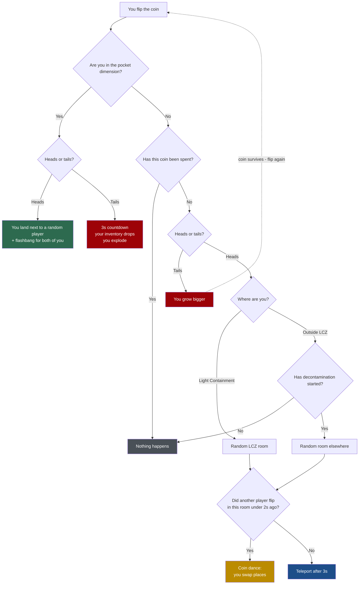

<div align="center">

# 🪙 MagicCoinSCPSL

**The coin stops being a useless item and becomes the most dangerous mechanic on your server.**

A plugin for **SCP: Secret Laboratory** servers running the [EXILED](https://github.com/ExMod-Team/EXILED) framework, where every player spawns with a gamble in their pocket.


</div>

---

## Table of contents

- [The idea](#the-idea)
- [How the coin works](#how-the-coin-works)
- [Mechanics](#mechanics)
  - [🌀 The pocket dimension](#-the-pocket-dimension)
  - [💀 Tails: you grow](#-tails-you-grow)
  - [💃 The coin dance](#-the-coin-dance)
  - [🎰 The SCP-173 machine](#-the-scp-173-machine)
  - [📢 Server-wide comedy](#-server-wide-comedy)
- [Requirements](#requirements)
- [Installation](#installation)
- [Calibrating the machine spot](#calibrating-the-machine-spot)
- [Configuration](#configuration)
- [Translations](#translations)
- [Permissions](#permissions)
- [Building](#building)
- [Project layout](#project-layout)

---

## The idea

Everyone who spawns gets **one free coin**. It works exactly once, and what it does depends on
where you are and how it lands.

It is not a teleport: it is a bet. Heads moves you, tails punishes you, and inside the pocket
dimension heads saves your life while tails takes it.

> [!TIP]
> The point of this plugin is that **the whole server finds out**. Coin deaths are announced,
> jackpots are called out by C.A.S.S.I.E., and the body count is published when the round ends.

---

## How the coin works



**The same thing as a table:**

| Where | Heads | Tails |
|---|---|---|
| **Light Containment** | Another LCZ room | You grow bigger, coin survives |
| **Outside LCZ** | Another room, *only after decontamination* | You grow bigger, coin survives |
| **Pocket dimension** | You land on top of someone, with a flashbang | Death on a countdown |

Flipping a coin that has already been spent does nothing but print a notice: *"this coin is
already spent"*.

---

## Mechanics

### 🌀 The pocket dimension

The coin behaves differently here: **it is a free 50/50 and the coin is never spent.** It does not
matter if you already used it back in LCZ — inside the pocket dimension you can always gamble.

**Heads** gets you out, but not into a room. You appear **right next to a random living player**
(SCPs included) with a flashbang between you. Both of you go blind, and neither knew the other was
about to be there.

**Tails** kills you, but with some theatre:

1. A warning hint: *"heads you leave, tails you leave in pieces"*.
2. A visible three second countdown.
3. Your inventory **drops on the pocket dimension floor** instead of being deleted.
4. An HE grenade with a 0.5s fuse, **attributed to you** — the killfeed will say you blew yourself up.

> [!NOTE]
> Leaving the loot on the floor is deliberate: the next person who falls into the pocket dimension
> finds a pile of guns, a coin and no body. That writes its own stories.

---

### 💀 Tails: you grow

**Tails does not spend the coin.** You keep flipping until heads finally lands — but every tails
makes you **bigger**, and it stacks.

| Tails in a row | Your size | Movement |
|:---:|:---:|:---:|
| 1 | 115% | -3% |
| 2 | 130% | -6% |
| 3 | 145% | -9% |
| 5 | 175% | -15% |
| 7 or more | 200% *(capped)* | -20% |

Carrying more of yourself around costs something, so the slowdown scales with your size: barely
there on the first tails, a real handicap near the cap. Heads hands both back along with the
teleport. The growth lands after the same three second
delay, so it arrives when the coin does rather than before you have seen it spin.

Growing is the one punishment that is never secretly a reward. A small player is a *harder* target;
a big one is easier to hit, easier to spot down a corridor, slower to get away, and past a certain
size stops fitting through doorways. The more you push your luck, the more you advertise it.

> [!TIP]
> The escalation is what makes unlimited flipping fair. The first tails barely registers; by the
> fifth you are a slow, wide landmark. Tune it with `tails_growth_step`, `tails_growth_max` and
> `tails_growth_slowness_at_max`.

#### The old roulette

The weighted table of one-off punishments is still in the plugin, switched off. Set
`tails_punishment` to `Roulette` to use it instead of growth.

<details>
<summary><b>The ten outcomes and their weights</b></summary>

| Id | Weight | What it does to you |
|---|:---:|---|
| `flashbang` | 18 | A flashbang at your own feet |
| `sugar_rush` | 16 | SCP-207 at intensity 4 plus blurred vision. Good luck stopping |
| `shrink` | 14 | You shrink to 40% for 15 seconds |
| `severed_hands` | 12 | You cannot hold anything for 20 seconds |
| `tantrum` | 12 | An SCP-173 tantrum appears under your feet |
| `giant` | 10 | You grow 60% bigger. And far more visible |
| `candy` | 8 | Your whole inventory turns into one SCP-330 candy |
| `swap_positions` | 6 | You swap places with a random player, **SCPs included** |
| `swap_inventories` | 3 | You swap inventories with another player. Neither of you is warned |
| `fake_cassie` | 1 | C.A.S.S.I.E. announces a containment breach that never happened |

Weights are relative and live in the config. Set one to **`0`** to disable that outcome without
touching code.

</details>

> [!IMPORTANT]
> Players inside the pocket dimension are **never** eligible for the swaps. Otherwise
> `swap_positions` would be a free way out of the pocket dimension, or a free way in without a coin.

---

### 💃 The coin dance

If **two players flip heads in the same room** less than two seconds apart, their teleports are
cancelled and they **swap places with each other** instead.

One ends up where the other was, both stand there looking at each other, and nobody planned it.

---

### 🎰 The SCP-173 machine

Drop a coin on a specific spot in the SCP-173 room and it is traded for a random item out of a
pool of 54: anything from loose ammo to an O5 keycard.

If it rolls one of the jackpot items — **MicroHID, Particle Disruptor, O5 keycard, Logicer,
FR-MG-0 or Jailbird** — C.A.S.S.I.E. announces it to the entire server:

> *attention . a subject has won the lottery*

And that is the joke: you just won the prize and, with it, a target on your back.

---

### 📢 Server-wide comedy

| Event | What gets announced |
|---|---|
| **Coin death** | Dying within 15s of a coin teleport: *"X trusted the coin. The coin did not trust them."* |
| **Jackpot** | C.A.S.S.I.E. plus a broadcast naming the player and the item |
| **Round end** | *"The coin claimed N lives today, over M flips."* |
| **Decontamination** | `COIN TP ENABLED IN ALL THE FACILITY` |

---

## Requirements

- SCP: Secret Laboratory (dedicated server)
- EXILED **8.9.11** or higher

---

## Installation

1. Build the project or download the latest release `.dll`.
2. Drop `ItemRandomizerPlugin_SCPSL.dll` into your server's `EXILED/Plugins` folder.
3. Start the server once: the config and the translations file are generated automatically.
4. **Calibrate the SCP-173 machine spot** (see the next section).

---

## Calibrating the machine spot

> [!WARNING]
> **This step is mandatory when upgrading from 1.0.0.** The old `roompoint` command recorded the
> spot by running `TransformPoint` on a coordinate that was already in world space, so the stored
> value is not a valid local coordinate. Until you recalibrate it, the SCP-173 machine will not
> respond where you expect.

1. Grant your rank the `magiccoin.roompoint` permission in `permissions.yml`.
2. Join the server, stand in the SCP-173 room and **look at the exact spot** you want to use.
3. Run `roompoint` (alias `rp`) in Remote Admin.
4. Paste the block it prints straight into the config:

```yaml
randomizer_room: Lcz173
randomizer_drop_point:
  x: 1.234
  y: 0.567
  z: -8.901
```

5. Adjust `randomizer_radius` if you want a tighter or looser area. It defaults to 3 metres.

> [!TIP]
> With `debug: true` the plugin logs the exact distance from every dropped coin to the configured
> spot. It is the fastest way to tune it without guessing.

---

## Configuration

### General

| Key | Type | Default | What it does |
|---|---|:---:|---|
| `is_enabled` | bool | `true` | Enables the plugin |
| `debug` | bool | `false` | Console diagnostics: distances, rolled items, outcome ids |
| `broadcast_duration` | ushort | `6` | Duration of the plugin's broadcasts |

### Coin distribution

| Key | Type | Default | What it does |
|---|---|:---:|---|
| `coin_denied_roles` | list | NTF + Chaos | Roles that do **not** get a coin on spawn |

SCPs, spectators and anyone with a full inventory never receive one, whether or not they are on
the list.

### Teleport

| Key | Type | Default | What it does |
|---|---|:---:|---|
| `teleport_delay` | float | `3` | Seconds between the flip and the effect |
| `sink_hole_duration` | float | `5` | Duration of the `SinkHole` effect on arrival |
| `lcz_rooms` | list | 12 rooms | Possible destinations inside Light Containment |
| `non_lcz_rooms` | list | 32 rooms | Possible destinations outside Light Containment |

### SCP-173 machine

| Key | Type | Default | What it does |
|---|---|:---:|---|
| `randomizer_enabled` | bool | `true` | Enables the machine |
| `randomizer_room` | RoomType | `Lcz173` | Room the spot lives in |
| `randomizer_drop_point` | x/y/z | — | Point **local to the room**. See [calibrating](#calibrating-the-machine-spot) |
| `randomizer_radius` | float | `3` | Detection radius in metres |
| `randomizer_items` | list | 54 items | Prize pool |
| `randomizer_jackpot_items` | list | 6 items | Prizes that trigger the announcement |
| `announce_jackpot` | bool | `true` | Enables the C.A.S.S.I.E. announcement |
| `jackpot_cassie_message` | string | *see above* | Jackpot C.A.S.S.I.E. line |

### Tails punishment

| Key | Type | Default | What it does |
|---|---|:---:|---|
| `tails_punishment` | enum | `Growth` | `Growth`, `Roulette` or `None` |
| `tails_growth_step` | float | `0.15` | How much bigger each tails makes you, as a fraction of normal size |
| `tails_growth_max` | float | `2` | Size cap. Past roughly `2.2` players start getting stuck in doorways |
| `tails_growth_slowness_at_max` | int | `20` | How much slower you move at the cap, as a percentage. Scales with size. `0` makes growth cosmetic |

Roulette mode only — ignored while `tails_punishment` is `Growth`:

| Key | Type | Default | What it does |
|---|---|:---:|---|
| `tails_outcome_weights` | map | *see table* | Weight per outcome. `0` disables it |
| `scale_outcome_duration` | float | `15` | How long shrink/giant last |
| `shrink_scale` | float | `0.4` | Size multiplier when shrinking |
| `giant_scale` | float | `1.6` | Size multiplier when growing |
| `severed_hands_duration` | float | `20` | Duration of `SeveredHands` |
| `fake_cassie_message` | string | *a lie about SCP-173* | The fake announcement |

### Coin dance

| Key | Type | Default | What it does |
|---|---|:---:|---|
| `coin_dance_enabled` | bool | `true` | Enables the two-player swap |
| `coin_dance_window` | float | `2` | Window in seconds for it to count |

### Pocket dimension

| Key | Type | Default | What it does |
|---|---|:---:|---|
| `pocket_gamble_enabled` | bool | `true` | Enables the 50/50 inside the pocket dimension |
| `pocket_escape_next_to_player` | bool | `true` | Heads drops you next to someone. If `false`, a random room |
| `pocket_flash_fuse` | float | `0.15` | Fuse on the escape flashbang |
| `pocket_flash_blind_duration` | float | `4` | Guaranteed blindness for both, on top of the grenade. `0` to rely on the grenade alone |
| `pocket_countdown_seconds` | int | `3` | Countdown seconds before death |
| `pocket_grenade_fuse` | float | `0.5` | Fuse on the HE grenade |
| `pocket_drop_loot` | bool | `true` | Drop the inventory on the floor instead of deleting it |

If nobody is alive outside the pocket dimension, the escape falls back to a random room.

### Announcements

| Key | Type | Default | What it does |
|---|---|:---:|---|
| `death_callout_enabled` | bool | `true` | Announces coin deaths |
| `death_callout_window` | float | `15` | Seconds after a teleport in which a death still counts |
| `round_end_stats_enabled` | bool | `true` | Announces the tally when the round ends |
| `decontamination_broadcast_duration` | ushort | `10` | Duration of the decontamination notice |

---

## Translations

**Every** player-facing string lives in the translations file EXILED generates, not in the code.
They can be rewritten without recompiling. The shipped defaults are in Spanish.

| Key | When it shows |
|---|---|
| `coin_already_used` | You flip a spent coin |
| `teleport_pending` | During the three second wait |
| `coin_dance` | Coin dance. `{0}` = the other player |
| `pocket_prompt` | You flip inside the pocket dimension |
| `pocket_countdown` | Countdown. `{0}` = seconds left |
| `pocket_doom` | Last warning before the grenade |
| `pocket_escape` | You escape. `{0}` = who you land on |
| `pocket_escape_victim` | Someone lands on you. `{0}` = who |
| `tails_growth` | Every tails while growth stacks. `{0}` = your new size as a percentage |
| `tails_growth_capped` | The tails that pushes you to the cap. `{0}` = the cap |
| `growth_reset` | Heads lands and the coin gives your size back |
| `tails_swap_inventories` | `{0}` = the other player |
| `tails_swap_positions` | `{0}` = the other player |
| `tails_severed_hands` | Severed hands punishment |
| `tails_shrink` | Shrink punishment |
| `tails_giant` | Giant punishment |
| `tails_sugar_rush` | Cola punishment |
| `tails_candy` | Candy punishment |
| `tails_flashbang` | Flashbang punishment |
| `tails_tantrum` | Tantrum punishment |
| `tails_fake_cassie` | Fake announcement punishment |
| `death_callout` | Coin death. `{0}` = nickname |
| `jackpot_broadcast` | Jackpot. `{0}` = nickname, `{1}` = item |
| `round_end_stats` | Round end. `{0}` = deaths, `{1}` = flips |
| `decontamination_broadcast` | Decontamination starts |

They accept the game's rich text tags (`<color>`, `<b>`, `<size>`).

---

## Permissions

| Node | What it unlocks |
|---|---|
| `magiccoin.roompoint` | The `roompoint` / `rp` command in Remote Admin |

```yaml
# permissions.yml
moderator:
  inheritance: []
  permissions:
    - magiccoin.roompoint
```

---

## Building

The project targets **.NET Framework 4.8** and references the dedicated server and EXILED
assemblies by absolute path in the `.csproj`. Point them at your own installation before building.

```bash
"C:/Program Files/Microsoft Visual Studio/2022/Community/MSBuild/Current/Bin/MSBuild.exe" ItemRandomizerPlugin_SCPSL.sln -t:Rebuild -p:Configuration=Debug
```

The `.dll` lands in `ItemRandomizerPlugin_SCPSL/bin/Debug/`.

---

## Project layout

```
ItemRandomizerPlugin_SCPSL/
├── ItemRandomizer.cs        Plugin entry point, event registration
├── PlayerHandler.cs         Handlers, teleports, pocket dimension, dance, coin bookkeeping
├── CoinOutcomes.cs          Weighted table of tails punishments
├── Config.cs                Everything configurable
├── Translations.cs          Every player-facing string
└── RoomPoints/
    ├── RoomCommand.cs       The 'roompoint' coordinate capture command
    ├── RoomPointObject.cs   Room plus relative position pair
    └── SerializedVector3.cs YAML-serializable Vector3
```

**Adding a new punishment to the roulette** only touches two places: one entry in the table in
`CoinOutcomes.cs` and one weight in `tails_outcome_weights`. `OnFlip` never changes.

---

<div align="center">

Made by **Megalón** · Built on [EXILED](https://github.com/ExMod-Team/EXILED)

</div>
